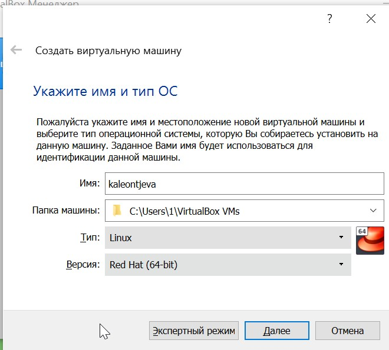
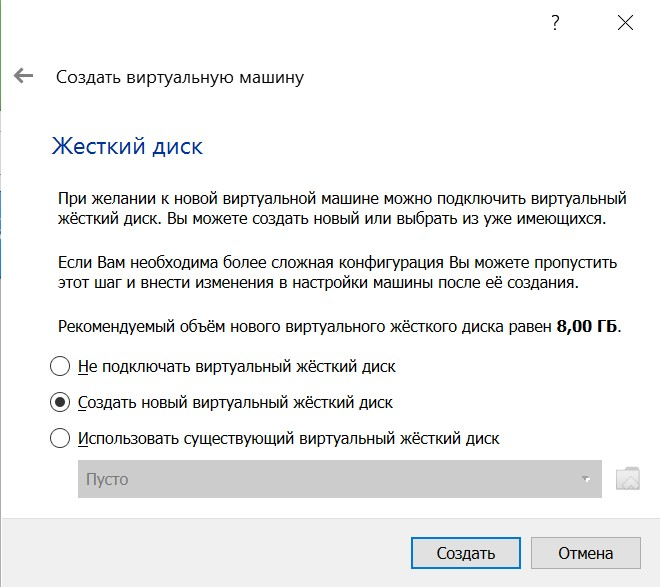
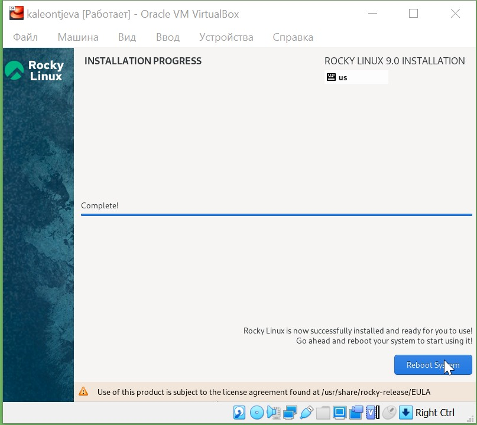
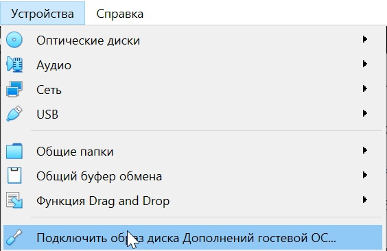

---
## Front matter
lang: ru-RU
title: Лабораторная работа №1
subtitle: Информационная безопасность
author:
  - Леонтьева К. А., НПМбд-01-19
institute:
  - Российский университет дружбы народов
  - Москва, Россия
date: 10 сентября 2022

## i18n babel
babel-lang: russian
babel-otherlangs: english

## Formatting pdf
toc: false
toc-title: Содержание
slide_level: 2
aspectratio: 169
section-titles: true
theme: metropolis
header-includes:
 - \metroset{progressbar=frametitle,sectionpage=progressbar,numbering=fraction}
 - '\makeatletter'
 - '\beamer@ignorenonframefalse'
 - '\makeatother'
---

## Цели лабораторной работы

1) Приобретение практических навыков установки ОС на виртуальную машину
2) Настройка минимально необходимых для дальнейшей работы сервисов

## Задачи лабораторной работы
1) Установить VirtualBox
2) Установить дистрибутив Rocky и настроить виртуальную машину
3) Установить дополнения

## Ход выполнения лабораторной работы
- Скачиваем VirtualBox и создаем виртуальную машину.

{ #fig:001 width=40% }

## Ход выполнения лабораторной работы
- Создаём новый динамический виртуальный жёсткий диск

{ #fig:003 width=40% }

## Ход выполнения лабораторной работы
- Выбрав в разделе "Носители" оптический диск и запустив машину, переходим к её настройке. Выбираем английский язык

{ #fig:010 width=40% }

## Ход выполнения лабораторной работы
- В появившемся окне настроек настраиваем необходимые параметры, например, создаем пользователя с правами администратора

{ #fig:018 width=40% }

## Ход выполнения лабораторной работы
- Завершаем установку операционной системы, корректно перезагружаем виртуальную машину

{ #fig:019 width=40% }

## Ход выполнения лабораторной работы
- В разделе "Устройства" выбираем "Подключить образ диска дополнений гостевой ОС",  после чего запускаем образ диска дополнений гостевой ОС.

{ #fig:022 width=40% }

## Вывод
- В ходе выполнения данной лабораторной работы я приобрела практические навыки установки операционной системы на виртуальную машину и настройки минимально необходимых для дальнейшей работы сервисов

