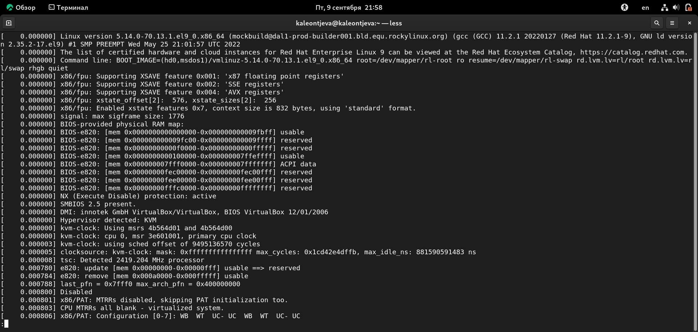

---
## Front matter
title: "Лабораторная работа №1"
subtitle: "Информационная безопасность"
author: "Леонтьева Ксения Андреевна | НПМбд-01-19"

## Generic otions
lang: ru-RU
toc-title: "Содержание"

## Bibliography
bibliography: bib/cite.bib
csl: pandoc/csl/gost-r-7-0-5-2008-numeric.csl

## Pdf output format
toc: true # Table of contents
toc-depth: 2
lof: true # List of figures
fontsize: 12pt
linestretch: 1.5
papersize: a4
documentclass: scrreprt
## I18n polyglossia
polyglossia-lang:
  name: russian
  options:
	- spelling=modern
	- babelshorthands=true
polyglossia-otherlangs:
  name: english
## I18n babel
babel-lang: russian
babel-otherlangs: english
## Fonts
mainfont: PT Serif
romanfont: PT Serif
sansfont: PT Sans
monofont: PT Mono
mainfontoptions: Ligatures=TeX
romanfontoptions: Ligatures=TeX
sansfontoptions: Ligatures=TeX,Scale=MatchLowercase
monofontoptions: Scale=MatchLowercase,Scale=0.9
## Biblatex
biblatex: true
biblio-style: "gost-numeric"
biblatexoptions:
  - parentracker=true
  - backend=biber
  - hyperref=auto
  - language=auto
  - autolang=other*
  - citestyle=gost-numeric
## Pandoc-crossref LaTeX customization
figureTitle: "Рис."
tableTitle: "Таблица"
listingTitle: "Листинг"
lofTitle: "Список иллюстраций"
lotTitle: "Список таблиц"
lolTitle: "Листинги"
## Misc options
indent: true
header-includes:
  - \usepackage{indentfirst}
  - \usepackage{float} # keep figures where there are in the text
  - \floatplacement{figure}{H} # keep figures where there are in the text
---

# Цель работы

Приобретение практических навыков установки операционной системы на виртуальную машину и настройки минимально необходимых для дальнейшей работы сервисов.

# Выполнение лабораторной работы

Для начала с официального сайта была скачана и установлена VirtualBox.

Далее запускаем VirtualBox, выбираем "Создать". 
В появившемся окне указываем имя ОС (kaleontjeva) и тип ОС (Linux, Red Hat (64-bit)) (рис. [-@fig:001]).

{ #fig:001 width=70% }

Указываем объём памяти - 2048 МБ (рис. [-@fig:002]).

{ #fig:002 width=70% }

Создаем новый динамический виртуальный жёсткий диск: задаем его тип - VDI, формат хранения - динамический и размер файла - 40 ГБ (рис. [-@fig:003]-[-@fig:006]).

{ #fig:003 width=70% }

{ #fig:004 width=70% }

{ #fig:005 width=70% }

{ #fig:006 width=70% }

Затем нажимаем "Настроить", переходим в раздел "Носители" и выбираем оптический диск - ранее скачанный с официального сайта дистрибутив "Rocky" (рис. [-@fig:007]).

{ #fig:007 width=70% }

Теперь запускаем виртуальную машину ((рис. [-@fig:008], [-@fig:009]).

{ #fig:008 width=70% }

{ #fig:009 width=70% }

Переходим к настройке машины. Выбираем английский язык (рис. [-@fig:010]).

{ #fig:010 width=70% }

Выбираем языки раскладки и комбинацию клавиш для переключения между ними(рис. [-@fig:011]).

{ #fig:011 width=70% }

Выбираем дополнительный язык - русский (рис. [-@fig:012]).

{ #fig:012 width=70% }

Выбираем программы: базовое окружение Server with GUI и дополнение Development Tools (рис. [-@fig:013]).

{ #fig:013 width=70% }

Отключаем KDUMP (рис. [-@fig:014]).

{ #fig:014 width=70% }

Место установки ОС оставляем без изменения (рис. [-@fig:015]).

{ #fig:015 width=70% }

Включаем сетевое соединение и в качестве имени узла указываем kaleontjeva.localdomain (рис. [-@fig:016]).

{ #fig:016 width=70% }

Устанавливаем пароль для root (рис. [-@fig:017]).

{ #fig:017 width=70% }

Создаем пользователя с правами администратора (рис. [-@fig:018]).

{ #fig:018 width=70% }

Завершаем установку операционной системы, корректно перезагружаем виртуальную машину (рис. [-@fig:019]).

{ #fig:019 width=70% }

Теперь можно войти в систему, введя пароль (рис. [-@fig:020]).

{ #fig:020 width=70% }

Чтобы подключить образ диска дополнений гостевой ОС, сначала удаляем устройство в разделе "Носители" и оставляем диск пустым (рис. [-@fig:021]).

{ #fig:021 width=70% }

Затем в разделе "Устройства" выбираем "Подключить образ диска дополнений гостевой ОС" (рис. [-@fig:022]).

{ #fig:022 width=70% }

Запускаем образ диска дополнений гостевой ОС (рис. [-@fig:023]).

{ #fig:023 width=70% }

После загрузки дополнений нажимаем Enter и корректно перезапускаем виртуальную машину.

Таким образом, установили операционную систему Linux с дистрибутивом Rocky, а также дополнения гостевой ОС, благодаря которым теперь не нужно нажимать хост-клавишу для переключения мышки между двумя ОС и можно настроить разрешение экрана.

# Домашнее задание

Загружаем графическое окружение и открываем консоль. Анализируем последовательность загрузки системы, используя команду "sudo dmesg" и введя пароль (рис. [-@fig:024]).

{ #fig:024 width=100% }

Смотрим вывод этой команды, выполнив "sudo dmesg | less" (рис. [-@fig:025], [-@fig:026]). В данном случае после каждого нажатия клавиши "Enter" в консоли отображается только одна команда.

{ #fig:025 width=100% }

{ #fig:026 width=100% }

Далее получаем следующую информацию (рис. [-@fig:027], [-@fig:028]).

1. Версия ядра Linux: dmesg | grep -i "Linux version". Ответ: 5.14.0-70.13.1.el9_0.x86_64
2. Частота процессора: dmesg | grep -i "Mhz". Ответ: 2419.204 MHz
3. Модель процессора: dmesg | grep -i "CPU0". Ответ: 11th Gen Intel(R) Core(TM) i5-1135G7 @ 2.40GHz
4. Объём доступной оперативной памяти: dmesg | grep -i "Memory". Ответ: 2096696K
5. Тип обнаруженного гипервизора: dmesg | grep -i "Hypervisor detected". Ответ: KVM
6. Тип файловой системы корневого раздела и последовательность монтирования файловых систем: dmesg | grep -i "Mount". Ответ: XFS

{ #fig:027 width=100% }

{ #fig:028 width=100% }

# Контрольные вопросы

1. Учетная запись пользователя - это необходимая для системы информация о пользователе, которая хранится в специальных файлах. Вся информация о пользователе обычно хранится в файлах /etc/passwd и /etc/group. Учетная запись пользователя содержит: имя пользователя (user name), идентификационный номер группы (GID), идентификационный номер пользователя (UID), пароль (password), полное имя (full name), домашний каталог (home directory), начальную оболочку (login shell).

2. Команды терминала:
	1. Для получения справки по команде: man команда. Например, команда "man ls" выведет справку о команде "ls".
	2. Для перемещения по файловой системе: cd путь. Например, команда "cd newdir" осуществляет переход в каталог newdir.
	3. Для просмотра содержимого каталога: ls опции путь. Например, команда "ls -a ~/newdir" отобразит имена скрытых файлов в каталоге newdir.
	4. Для определения объёма каталога: du опция путь. Например, команда "du -k ~/newdir" выведет размер каталога newdir в килобайтах.
	5. Для создания / удаления каталогов / файлов: mkdir опции путь / rmdir опции путь / rm опции путь. Например, команда "mkdir -p ~/newdir1/newdir2" создаст иерархическую цепочку подкаталогов, создав каталоги newdir1 и newdir2; команда "rmdir -v ~/newdir" удалит каталог newdir; команда "rm -r ~/newdir" так же удалит каталог newdir.
	6. Для задания определённых прав на файл / каталог: chmod опции путь. Например, команда "chmod g+r ~/text.txt" даст группе право на чтение файла text.txt.
	7. Для просмотра истории команд: history опции. Например, команда "history 5" покажет список последних 5 команд.

3. Файловая система имеет два значения: с одной стороны - это архитектура хранения битов на жёстком диске, с другой - это организация каталогов в соответствии с идеалогией Linux. Файловая система - это архитектура хранения данных в системе, хранение данных в оперативной памяти и доступа к конфигурации ядра. В физическом смысле файловая система Linux представляет собой пространство раздела диска, разбитое на блоки фиксированного размера. Их размер кратен размеру сектора: 1024, 2048, 4096 или 8120 байт. Примеры файловых систем: 
	1. XFS рассчитана на файлы большого размера, поддерживает диски до 2 терабайт. Преимущества: высокая скорость работы с большими файлами, отложенное выделение места, увеличение разделов на лету, незначительный размер служебной информации. Недостатки: невозможность уменьшения размера, сложность восстановления данных и риск потери файлов при аварийном отключении питания.
	2. Ext2, Ext3, Ext4 или Extended Filesystem - стандартная файловая система, первоначально разработанная еще для Minix. Содержит максимальное количество функций и является наиболее стабильной в связи с редкими изменениями кодовой базы. Начиная с ext3 в системе используется функция журналирования. Сегодня версия ext4 присутствует во всех дистрибутивах Linux.
	3. JFS или Journaled File System разработана в IBM в качестве альтернативы для файловых систем ext. Сейчас используется там, где необходима высокая стабильность и минимальное потребление ресурсов (в первую очередь в многопроцессорных компьютерах). В журнале хранятся только метаданные, что позволяет восстанавливать старые версии файлов после сбоев.

4. Команда "findmnt" или "findmnt --all" будет отображать все подмонтированные файловые системы или искать файловую систему.

5. Команда "kill -сигнал pid_процесса" позволяет удалить зависший процесс, где PID - уникальный идентификатор процесса. Сигналы могут быть следующие:
	1. SIGINT - самый безобидный сигнал завершения, означает Interrupt. Он отправляется процессу, запущенному из терминала с помощью сочетания клавиш Ctrl+C. Процесс правильно завершает все свои действия и возвращает управление
	2. SIGQUIT - сигнал, который отправляется с помощью сочетания клавиш, программе, запущенной в терминале. Он сообщает ей, что нужно завершиться, и программа может выполнить корректное завершение или проигнорировать сигнал. В отличие от предыдущего, она генерирует дамп памяти. Сочетание клавиш Ctrl+/
	3. SIGHUP - сообщает процессу, что соединение с управляющим терминалом разорвано, отправляется, в основном, системой при разрыве соединения с интернетом.
	4. SIGTERM - немедленно завершает процесс, но обрабатывается программой, поэтому позволяет ей завершить дочерние процессы и освободить все ресурсы
	5. SIGKILL - тоже немедленно завершает процесс, но, в отличие от предыдущего варианта, он не передается самому процессу, а обрабатывается ядром. Поэтому ресурсы и дочерние процессы остаются запущенными

# Выводы

В ходе выполнения данной лабораторной работы я приобрела практические навыки установки операционной системы на виртуальную машину и настройки минимально необходимых для дальнейшей работы сервисов.

