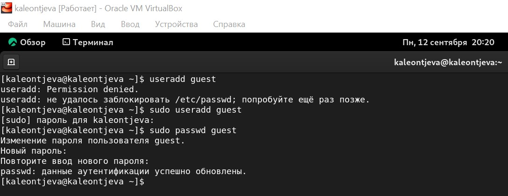
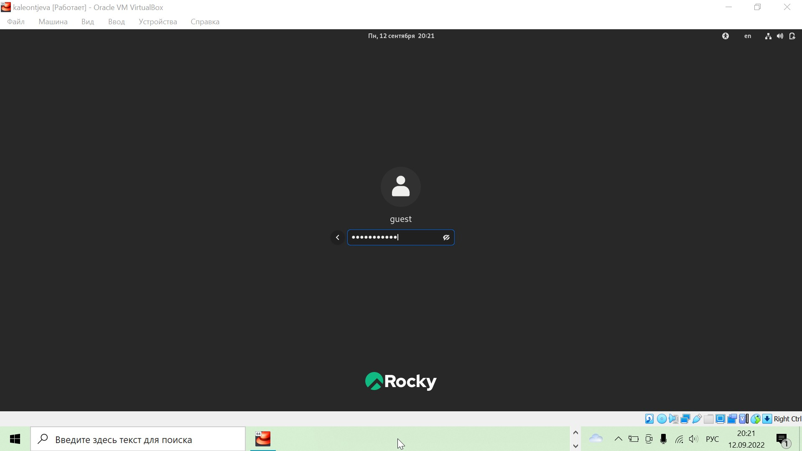
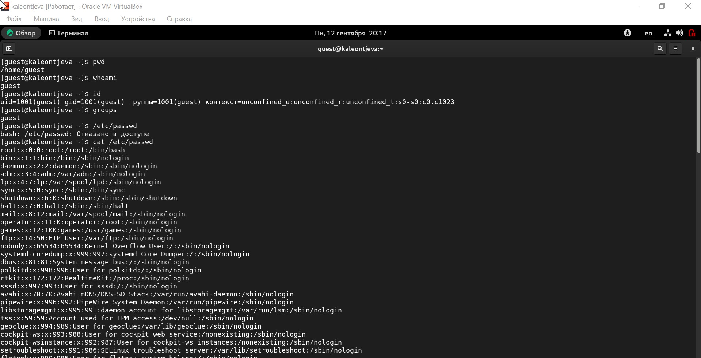
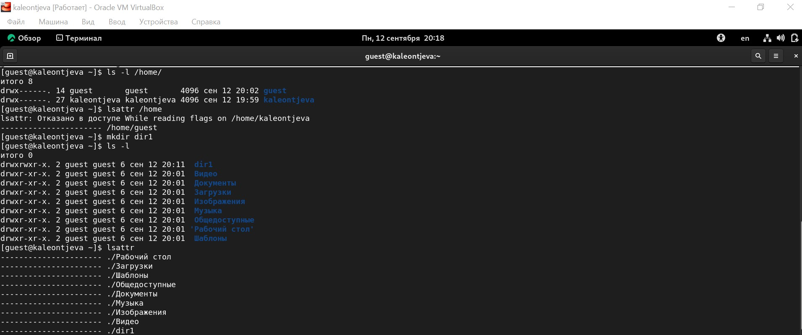
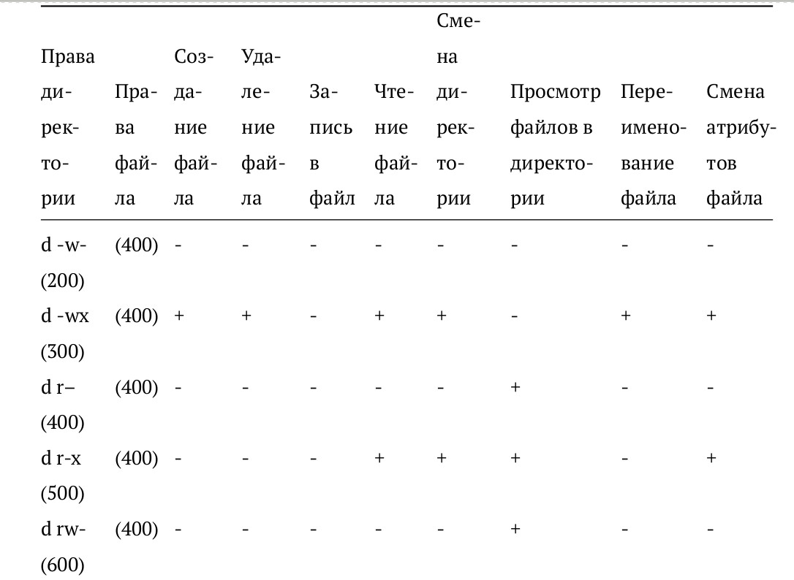
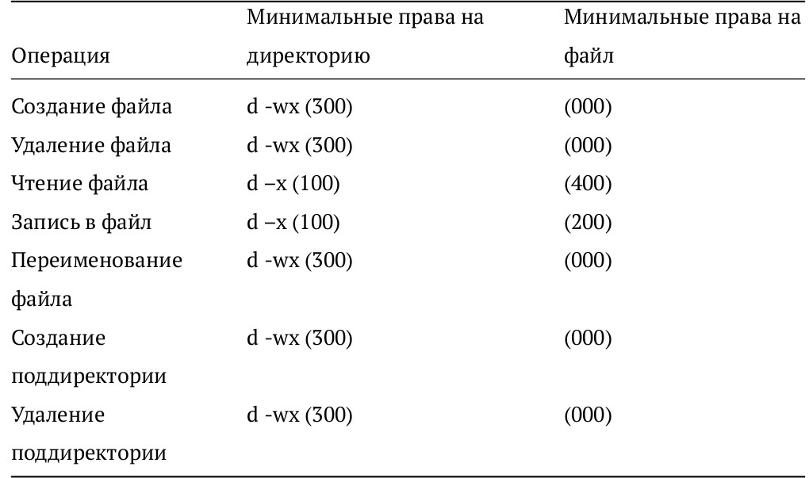

---
## Front matter
lang: ru-RU
title: Лабораторная работа №2
subtitle: Информационная безопасность
author:
  - Леонтьева К. А., НПМбд-01-19
institute:
  - Российский университет дружбы народов
  - Москва, Россия
date: 15 сентября 2022

## i18n babel
babel-lang: russian
babel-otherlangs: english

## Formatting pdf
toc: false
toc-title: Содержание
slide_level: 2
aspectratio: 169
section-titles: true
theme: metropolis
header-includes:
 - \metroset{progressbar=frametitle,sectionpage=progressbar,numbering=fraction}
 - '\makeatletter'
 - '\beamer@ignorenonframefalse'
 - '\makeatother'
---

## Цели лабораторной работы

1) Получение практических навыков работы в консоли с атрибутами файлов
2) Закрепление теоретических основ дискреционного разграничения доступа в
современных системах с открытым кодом на базе ОС Linux

## Задачи лабораторной работы
1) Создать новую учётную запись
2) Проанализировать права доступа и расширенные атрибуты для директорий и файлов

## Ход выполнения лабораторной работы
- Создаем нового пользователя guest

{ #fig:001 width=60% }

## Ход выполнения лабораторной работы
- Входим в систему от имени пользователя guest

{ #fig:003 width=60% }

## Ход выполнения лабораторной работы
- Изучение команд pwd, whoami, id, groups, cat, сравнение полученных данных

{ #fig:004 width=85% }

## Ход выполнения лабораторной работы
- Просмотр прав доступа и расширенных атрибутов для директорий в системе

{ #fig:006 width=90% }

## Ход выполнения лабораторной работы
- Заполнение таблицы "Установленные права и разрешённые действия"

{ #fig:008 width=60% }

## Ход выполнения лабораторной работы
- Заполнение таблицы «Минимально необходимые права для выполнения операций внутри директории»

{ #fig:009 width=60% }

## Вывод
- В ходе выполнения данной лабораторной работы я приобрела практические
навыки работы в консоли с атрибутами файлов, закрепила теоретические основы
дискреционного разграничения доступа в современных системах с открытым
кодом на базе ОС Linux

