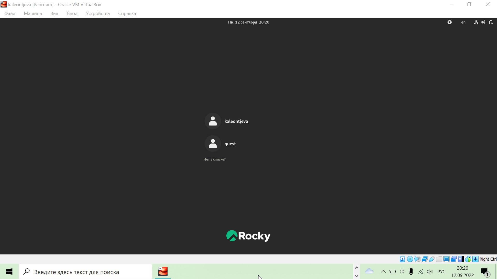
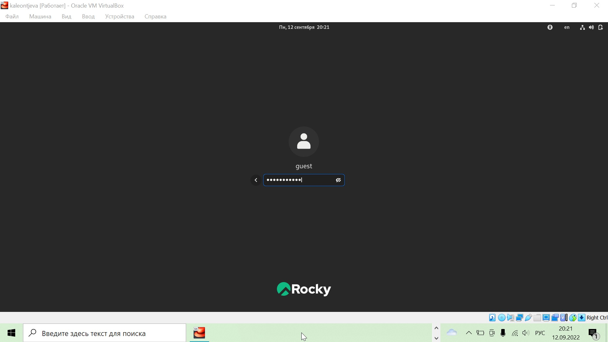
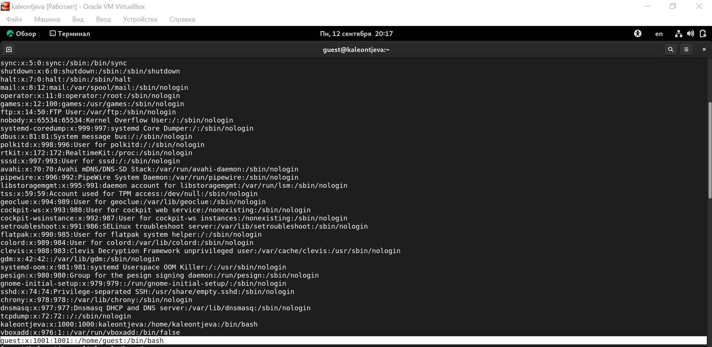
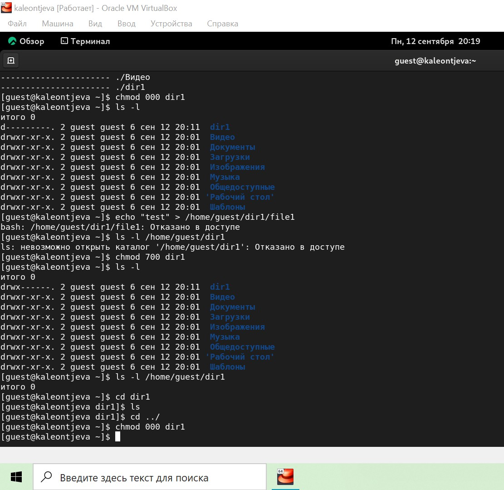

---
## Front matter
title: "Лабораторная работа №2"
subtitle: "Информационная безопасность"
author: "Леонтьева Ксения Андреевна | НПМбд-01-19"

## Generic otions
lang: ru-RU
toc-title: "Содержание"

## Bibliography
bibliography: bib/cite.bib
csl: pandoc/csl/gost-r-7-0-5-2008-numeric.csl

## Pdf output format
toc: true # Table of contents
toc-depth: 2
lof: true # List of figures
fontsize: 12pt
linestretch: 1.5
papersize: a4
documentclass: scrreprt
## I18n polyglossia
polyglossia-lang:
  name: russian
  options:
	- spelling=modern
	- babelshorthands=true
polyglossia-otherlangs:
  name: english
## I18n babel
babel-lang: russian
babel-otherlangs: english
## Fonts
mainfont: PT Serif
romanfont: PT Serif
sansfont: PT Sans
monofont: PT Mono
mainfontoptions: Ligatures=TeX
romanfontoptions: Ligatures=TeX
sansfontoptions: Ligatures=TeX,Scale=MatchLowercase
monofontoptions: Scale=MatchLowercase,Scale=0.9
## Biblatex
biblatex: true
biblio-style: "gost-numeric"
biblatexoptions:
  - parentracker=true
  - backend=biber
  - hyperref=auto
  - language=auto
  - autolang=other*
  - citestyle=gost-numeric
## Pandoc-crossref LaTeX customization
figureTitle: "Рис."
tableTitle: "Таблица"
listingTitle: "Листинг"
lofTitle: "Список иллюстраций"
lotTitle: "Список таблиц"
lolTitle: "Листинги"
## Misc options
indent: true
header-includes:
  - \usepackage{indentfirst}
  - \usepackage{float} # keep figures where there are in the text
  - \floatplacement{figure}{H} # keep figures where there are in the text
---

# Цель работы

Получение практических навыков работы в консоли с атрибутами файлов, закрепление теоретических основ дискреционного разграничения доступа в современных системах с открытым кодом на базе ОС Linux.

# Теоретическое введение

В операционной системе Linux есть много отличных функций безопасности, но одна из самых важных - это система прав доступа к файлам.
Изначально каждый файл имел три параметра доступа. Вот они:

* Чтение - разрешает получать содержимое файла, но на запись нет. Для каталога позволяет получить список файлов и каталогов, расположенных в нем
* Запись - разрешает записывать новые данные в файл или изменять существующие, а также позволяет создавать и изменять файлы и каталоги
* Выполнение - невозможно выполнить программу, если у нее нет флага выполнения. Этот атрибут устанавливается для всех программ и скриптов, именно с помощью него система может понять, что этот файл нужно запускать как программу

Каждый файл имеет три категории пользователей, для которых можно устанавливать различные сочетания прав доступа:

* Владелец - набор прав для владельца файла, пользователя, который его создал или сейчас установлен его владельцем. Обычно владелец имеет все права, чтение, запись и выполнение
* Группа - любая группа пользователей, существующая в системе и привязанная к файлу. Но это может быть только одна группа и обычно это группа владельца, хотя для файла можно назначить и другую группу
* Остальные - все пользователи, кроме владельца и пользователей, входящих в группу файла

Команды, которые могут понадобиться при работе с правами доступа:

* "ls -l" - для просмотра прав доступа к файлам и каталогам
* "chmod категория действие флаг файл или каталог" - для изменения прав доступа к файлам и каталогам (категорию действие и флаг можно заменить на набор из трех цифр от 0 до 7)

Значения флагов прав: 

* --- - нет никаких прав
* --x - разрешено только выполнение файла, как программы, но не изменение и не чтение
* -w- - разрешена только запись и изменение файла
* -wx - разрешено изменение и выполнение, но в случае с каталогом, невозможно посмотреть его содержимое
* r-- - права только на чтение
* r-x - только чтение и выполнение, без права на запись
* rw- - права на чтение и запись, но без выполнения
* rwx - все права

Более подробно см. в [@prava:bash]

# Выполнение лабораторной работы

В установленной при выполнении предыдущей лабораторной работы ОС создала учётную запись пользователя guest с помощью команды "sudo useradd guest" и задала пароль для этого пользователя командой "sudo passwd guest" (рис. [-@fig:001]).
 
{ #fig:001 width=70% }

Вошла в систему от имени пользователя guest (рис. [-@fig:002], [-@fig:003]).

{ #fig:002 width=100% }

{ #fig:003 width=100% }

Командой "pwd" определила, что нахожусь в директории /home/guest, которая и является моей домашней директорией (рис. [-@fig:004]). С приглашением командной строки совпадает.

Уточнила имя моего пользователя командой "whoami" и получила вывод: guest (рис. [-@fig:004]).

С помощью команды "id" определила имя своего пользователя - всё так же guest, uid = 1001 (guest), gid = 1001 (guest). Затем сравнила полученную информацию с выводом команды "groups", которая вывела "guest". Мой пользователь входит только в одну группу, состоящую из него самого, поэтому вывод обеих команд "id" и "groups" совпадает (рис. [-@fig:004]). Данные, выводимые в приглашении командной строки, совпадают с полученной информацией.

Затем просмотрела файл /etc/passwd командой "cat /etc/passwd" (рис. [-@fig:004]).

{ #fig:004 width=110% }

Нашла в нём свою учётную запись в самом конце (рис. [-@fig:005]). Uid = 1001, gid = 1001, то есть они совпадают с тем, что мы получили ранее.

{ #fig:005 width=110% }

Посмотрела, какие директории существуют в системе командой "ls -l /home/" (рис. [-@fig:006]). Список поддиректорий директории /home получить удалось. На директориях установлены права чтения, записи и выполнения для самого пользователя (для группы и остальных пользователей никаких прав доступа не установлено).

Проверила, какие расширенные атрибуты установлены на поддиректориях, находящихся в директории /home, командой "lsattr /home" (рис. [-@fig:006]). Удалось увидеть расширенные атрибуты только директории того пользователя, от имени которого я нахожусь в системе.

Создала в домашней директории поддиректорию dir1 командой "mkdir dir1" и определила, какие права доступа и расширенные атрибуты были на неё выставлены: чтение, запись и выполнение доступны для самого пользователя и для группы, для остальных - только чтение и выполнение, расширенных атрибутов не установлено (рис. [-@fig:006]).

{ #fig:006 width=110% }

Сняла с директории dir1 все атрибуты командой "chmod 000 dir1" и проверила с её помощью правильность выполнения команды "ls -l". Действительно, все атрибуты были сняты (рис. [-@fig:007]).

Попыталась создать в директории dir1 файл file1 командой echo "test" > /home/guest/dir1/file1 (рис. [-@fig:007]). Этого сделать не получилось, т.к. предыдущим действием мы убрали право доступа на запись в директории. В итоге файл не был создан (открыть директорию с помощью команды "ls -l /home/guest/dir1" изначально тоже не удалось по той же причине, поэтому я поменяла права доступа и снова воспользовалась этой командой, и тогда смогла просмотреть содержимое директории, убедившись, что файл не был создан).

{ #fig:007 width=70% }

Заполним таблицу «Установленные права и разрешённые действия» [-@tbl:std-dir].

: Установленные права и разрешённые действия {#tbl:std-dir}

| Права директории | Права файла | Cоздание файла | Удаление файла | Запись в файл | Чтение файла | Смена директории | Просмотр файлов в директории | Переименование файла |Смена атрибутов файла |
|------------------|-------------|----------------|----------------|---------------|--------------|------------------|------------------------------|----------------------|  ----------------------|
| d (000)          | (000)       | -              | -              | -             | -            | -                | -                            | -                   |  -                   |
| d --x (100)      | (000)       | -              | -              | -             | -            | +                | -                            | -                   |  -                   |
| d -w- (200)      | (000)       | -              | -              | -             | -            | -                | -                            | -                   |  -                   |
| d -wx (300)      | (000)       | +              | +              | -             | -            | +                | -                            | +                   |  -                   |
| d r-- (400)      | (000)       | -              | -              | -             | -            | -                | +                            | -                   | -                   |
| d r-x (500)      | (000)       | -              | -              | -             | -            | +                | +                            | -                   |  -                   |
| d rw- (600)      | (000)       | -              | -              | -             | -            | -                | +                            | -                   |  -                   |
| d rwx (700)      | (000)       | +              | +              | -             | -            | +                | +                            | +                   |   -                   |
|------------------|-------------|----------------|----------------|---------------|--------------|------------------|------------------------------|----------------------|  ----------------------|
| d (000)          | (100)       | -              | -              | -             | -            | -                | -                            | -                   |  -                   |
| d --x (100)      | (100)       | -              | -              | -             | -            | +                | -                            | -                   |  -                   |
| d -w- (200)      | (100)       | -              | -              | -             | -            | -                | -                            | -                   |  -                   |
| d -wx (300)      | (100)       | +              | +              | -             | -            | +                | -                            | +                   |  -                   |
| d r-- (400)      | (100)       | -              | -              | -             | -            | -                | +                            | -                   | -                   |
| d r-x (500)      | (100)       | -              | -              | -             | -            | +                | +                            | -                   |  -                   |
| d rw- (600)      | (100)       | -              | -              | -             | -            | -                | +                            | -                   |  -                   |
| d rwx (700)      | (100)       | +              | +              | -             | -            | +                | +                            | +                   |   -                   |
|------------------|-------------|----------------|----------------|---------------|--------------|------------------|------------------------------|----------------------|  ----------------------|
| d (000)          | (200)       | -              | -              | -             | -            | -                | -                            | -                   |  -                   |
| d --x (100)      | (200)       | -              | -              | +             | -            | +                | -                            | -                   |  -                   |
| d -w- (200)      | (200)       | -              | -              | -             | -            | -                | -                            | -                   |  -                   |
| d -wx (300)      | (200)       | +              | +              | +             | -            | +                | -                            | +                   |  -                   |
| d r-- (400)      | (200)       | -              | -              | -             | -            | -                | +                            | -                   | -                   |
| d r-x (500)      | (200)       | -              | -              | +             | -            | +                | +                            | -                   |  -                   |
| d rw- (600)      | (200)       | -              | -              | -             | -            | -                | +                            | -                   |  -                   |
| d rwx (700)      | (200)       | +              | +              | +             | -            | +                | +                            | +                   |   -                   |
|------------------|-------------|----------------|----------------|---------------|--------------|------------------|------------------------------|----------------------|  ----------------------|
| d (000)          | (300)       | -              | -              | -             | -            | -                | -                            | -                   |  -                   |
| d --x (100)      | (300)       | -              | -              | +             | -            | +                | -                            | -                   |  -                   |
| d -w- (200)      | (300)       | -              | -              | -             | -            | -                | -                            | -                   |  -                   |
| d -wx (300)      | (300)       | +              | +              | -             | +            | +                | -                            | +                   |  -                   |
| d r-- (400)      | (300)       | -              | -              | -             | -            | -                | +                            | -                   | -                   |
| d r-x (500)      | (300)       | -              | -              | +             | -            | +                | +                            | -                   |  -                   |
| d rw- (600)      | (300)       | -              | -              | -             | -            | -                | +                            | -                   |  -                   |
| d rwx (700)      | (300)       | +              | +              | +             | -            | +                | +                            | +                   |   -                   |
|------------------|-------------|----------------|----------------|---------------|--------------|------------------|------------------------------|----------------------|  ----------------------|
| d (000)          | (400)       | -              | -              | -             | -            | -                | -                            | -                   |  -                   |
| d --x (100)      | (400)       | -              | -              | -             | +            | +                | -                            | -                   |  +                   |
| d -w- (200)      | (400)       | -              | -              | -             | -            | -                | -                            | -                   |  -                   |
| d -wx (300)      | (400)       | +              | +              | -             | +            | +                | -                            | +                   |  +                   |
| d r-- (400)      | (400)       | -              | -              | -             | -            | -                | +                            | -                   | -                   |
| d r-x (500)      | (400)       | -              | -              | -             | +            | +                | +                            | -                   |  +                   |
| d rw- (600)      | (400)       | -              | -              | -             | -            | -                | +                            | -                   |  -                   |
| d rwx (700)      | (400)       | +              | +              | -             | +            | +                | +                            | +                   |   +                   |
|------------------|-------------|----------------|----------------|---------------|--------------|------------------|------------------------------|----------------------|  ----------------------|
| d (000)          | (500)       | -              | -              | -             | -            | -                | -                            | -                   |  -                   |
| d --x (100)      | (500)       | -              | -              | -             | +            | +                | -                            | -                   |  +                   |
| d -w- (200)      | (500)       | -              | -              | -             | -            | -                | -                            | -                   |  -                   |
| d -wx (300)      | (500)       | +              | +              | -             | +            | +                | -                            | +                   |  +                   |
| d r-- (400)      | (500)       | -              | -              | -             | -            | -                | +                            | -                   | -                   |
| d r-x (500)      | (500)       | -              | -              | -             | +            | +                | +                            | -                   |  +                   |
| d rw- (600)      | (500)       | -              | -              | -             | -            | -                | +                            | -                   |  -                   |
| d rwx (700)      | (500)       | +              | +              | -             | +            | +                | +                            | +                   |   +                   |
|------------------|-------------|----------------|----------------|---------------|--------------|------------------|------------------------------|----------------------|  ----------------------|
| d (000)          | (600)       | -              | -              | -             | -            | -                | -                            | -                   |  -                   |
| d --x (100)      | (600)       | -              | -              | +             | +            | +                | -                            | -                   |  +                   |
| d -w- (200)      | (600)       | -              | -              | -             | -            | -                | -                            | -                   |  -                   |
| d -wx (300)      | (600)       | +              | +              | +             | +            | +                | -                            | +                   |  +                   |
| d r-- (400)      | (600)       | -              | -              | -             | -            | -                | +                            | -                   | -                   |
| d r-x (500)      | (600)       | -              | -              | +             | +            | +                | +                            | -                   |  +                   |
| d rw- (600)      | (600)       | -              | -              | -             | -            | -                | +                            | -                   |  -                   |
| d rwx (700)      | (600)       | +              | +              | +             | +            | +                | +                            | +                   |   +                   |
|------------------|-------------|----------------|----------------|---------------|--------------|------------------|------------------------------|----------------------|  ----------------------|
| d (000)          | (700)       | -              | -              | -             | -            | -                | -                            | -                   |  -                   |
| d --x (100)      | (700)       | -              | -              | +             | +            | +                | -                            | -                   |  +                   |
| d -w- (200)      | (700)       | -              | -              | -             | -            | -                | -                            | -                   |  -                   |
| d -wx (300)      | (700)       | +              | +              | +             | +            | +                | -                            | +                   |  +                   |
| d r-- (400)      | (700)       | -              | -              | -             | -            | -                | +                            | -                   | -                   |
| d r-x (500)      | (700)       | -              | -              | +             | +            | +                | +                            | -                   |  +                   |
| d rw- (600)      | (700)       | -              | -              | -             | -            | -                | +                            | -                   |  -                   |
| d rwx (700)      | (700)       | +              | +              | +             | +            | +                | +                            | +                   |   +                   |

Заполним таблицу «Минимально необходимые права для выполнения операций внутри директории» [-@tbl:std-dir1].

: Минимально необходимые права для выполнения операций внутри директории {#tbl:std-dir1}

| Операция               | Минимальные права на директорию | Минимальные права на файл | 
|------------------------|---------------------------------|---------------------------|
| Создание файла         | d -wx (300)                     | (000)                     |
| Удаление файла         | d -wx (300)                     | (000)                     |
| Чтение файла           | d --x (100)                     | (400)                     |
| Запись в файл          | d --x (100)                     | (200)                     |
| Переименование файла   | d -wx (300)                     | (000)                     |
| Создание поддиректории | d -wx (300)                     | (000)                     |
| Удаление поддиректории | d -wx (300)                     | (000)                     |

# Выводы

В ходе выполнения данной лабораторной работы я приобрела практические навыки работы в консоли с атрибутами файлов, закрепила теоретические основы дискреционного разграничения доступа в современных системах с открытым кодом на базе ОС Linux.

# Список литературы{.unnumbered}

::: {#refs}
:::

