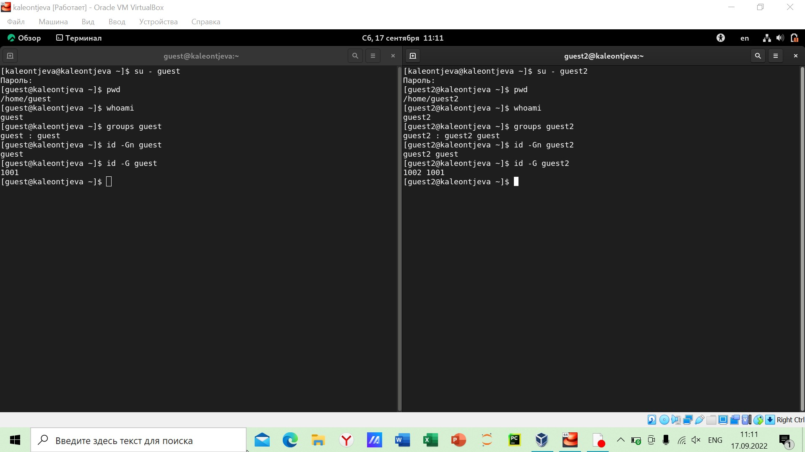

---
## Front matter
lang: ru-RU
title: Лабораторная работа №3
subtitle: Информационная безопасность
author:
  - Леонтьева К. А., НПМбд-01-19
institute:
  - Российский университет дружбы народов
  - Москва, Россия
date: 18 сентября 2022

## i18n babel
babel-lang: russian
babel-otherlangs: english

## Formatting pdf
toc: false
toc-title: Содержание
slide_level: 2
aspectratio: 169
section-titles: true
theme: metropolis
header-includes:
 - \metroset{progressbar=frametitle,sectionpage=progressbar,numbering=fraction}
 - '\makeatletter'
 - '\beamer@ignorenonframefalse'
 - '\makeatother'
---

## Цели лабораторной работы

1) Получение практических навыков работы в консоли с атрибутами файлов для групп пользователей

## Задачи лабораторной работы
1) Создать вторую новую учётную запись
2) Проанализировать права доступа и расширенные атрибуты для директорий и файлов для групп пользователей

## Ход выполнения лабораторной работы
- Создаем нового пользователя guest2 и добавляем его в группу guest

{ #fig:001 width=80% }

## Ход выполнения лабораторной работы
- Проверяем, в какие группы входят пользователи, с помощью команд "groups ..." и "id -G..."

{ #fig:002 width=80% }

## Ход выполнения лабораторной работы
- С помощью команды "cat /etc/group" просмотрела файл /etc/group

{ #fig:003 width=40% }

## Ход выполнения лабораторной работы
- Зарегистрировала пользователя guest2 в группе guest, а также изменила права директорий

{ #fig:004 width=70% }

## Ход выполнения лабораторной работы
- Заполнение таблицы "Установленные права и разрешённые действия"

{ #fig:005 width=60% }

## Ход выполнения лабораторной работы
- Заполнение таблицы «Минимально необходимые права для выполнения операций внутри директории»

{ #fig:006 width=60% }

## Вывод
- В ходе выполнения данной лабораторной работы я получила практические навыки работы в консоли с атрибутами файлов для групп пользователей

