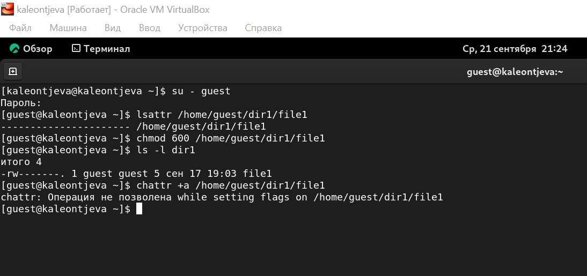
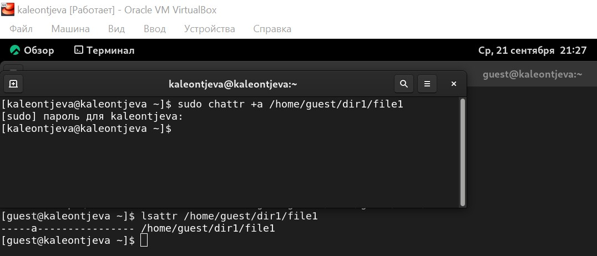
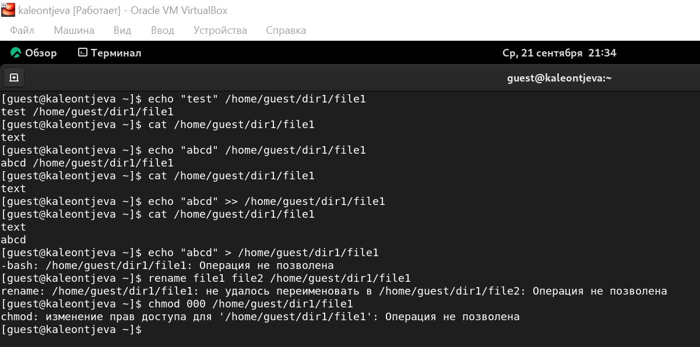
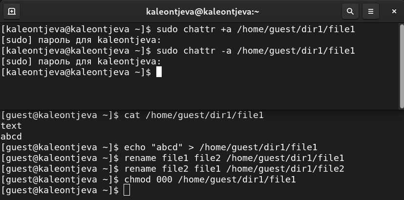
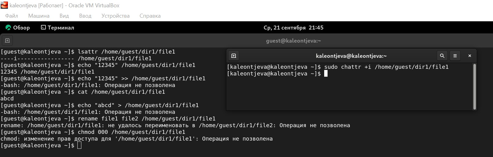

---
## Front matter
lang: ru-RU
title: Лабораторная работа №4
subtitle: Информационная безопасность
author:
  - Леонтьева К. А., НПМбд-01-19
institute:
  - Российский университет дружбы народов
  - Москва, Россия
date: 21 сентября 2022

## i18n babel
babel-lang: russian
babel-otherlangs: english

## Formatting pdf
toc: false
toc-title: Содержание
slide_level: 2
aspectratio: 169
section-titles: true
theme: metropolis
header-includes:
 - \metroset{progressbar=frametitle,sectionpage=progressbar,numbering=fraction}
 - '\makeatletter'
 - '\beamer@ignorenonframefalse'
 - '\makeatother'
---

## Цели лабораторной работы

1) Получение практических навыков работы в консоли с расширенными
атрибутами файлов

## Задачи лабораторной работы
1) Установить последовательно расширенные атрибуты "a" и "i"
2) При каждом расширенном атрибуте проверить возможность выполнения конкретных операций над файлом

## Ход выполнения лабораторной работы
- Просматриваем от имени пользователя guest расширенные атрибуты файла и пытаемся установить атрибут "a", в результате чего получаем ошибку

{ #fig:001 width=80% }

## Ход выполнения лабораторной работы
- От имени суперпользователя устанавливаем расширенный атрибут "a"

{ #fig:002 width=80% }

## Ход выполнения лабораторной работы
- Дозаписываем в файл слово и убеждаемся, что это нам удалось. Пытаемся удалить информацию из файла, переименовать и изменить права доступа - получаем ошибку

{ #fig:003 width=75% }

## Ход выполнения лабораторной работы
- Снимаем атрибут "a" с файла от имени суперпользователя и повторяем действия с предыдущего слайда - теперь ошибок не появилось

{ #fig:004 width=70% }

## Ход выполнения лабораторной работы
- От имени суперпользователя установливаем атрибут "i" и повторяем действия, которые выполняли ранее. Теперь файл можно только прочитать, а изменить, переименовать и изменить его атрибуты - нельзя

{ #fig:005 width=100% }

## Вывод
- В ходе выполнения данной лабораторной работы я получила практические навыки работы в консоли с расширенными атрибутами файлов, на практике опробовала действие расширенных атрибутов "a" и "i"

