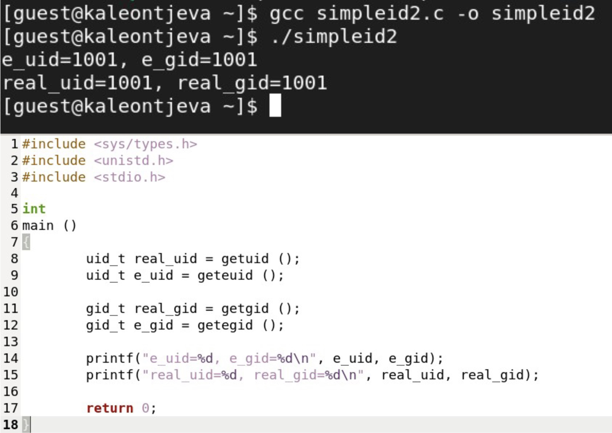
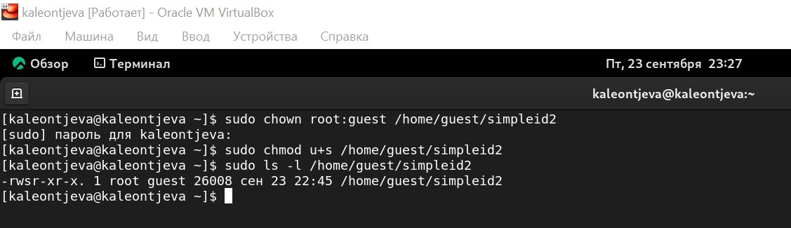
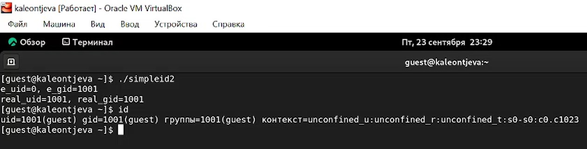
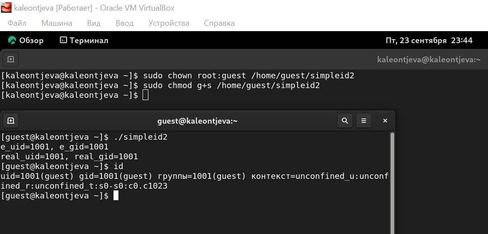
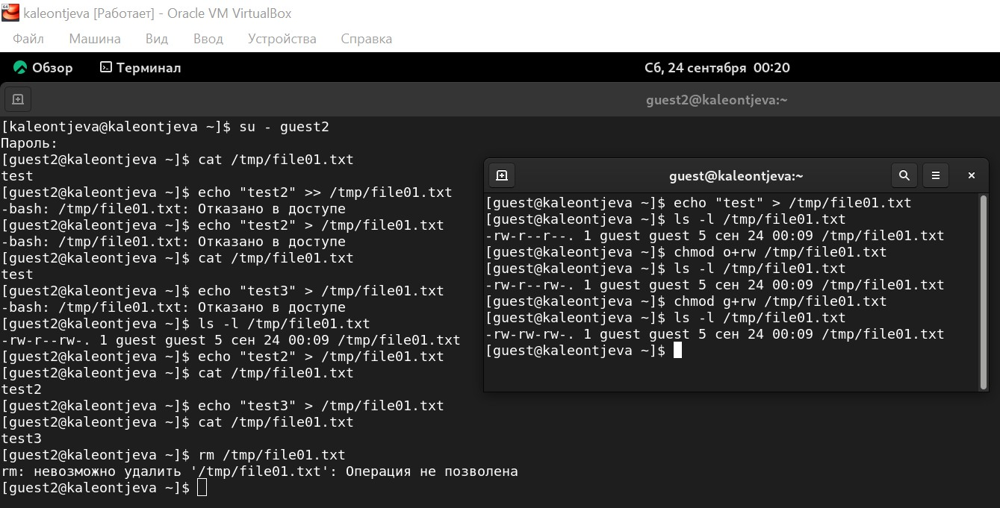
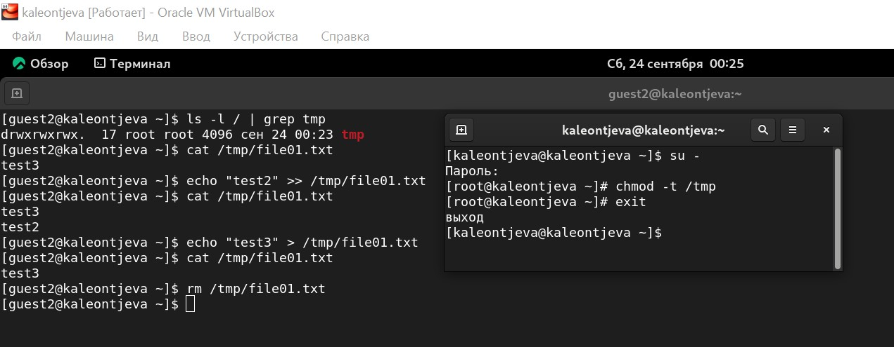

---
## Front matter
lang: ru-RU
title: Лабораторная работа №5
subtitle: Информационная безопасность
author:
  - Леонтьева К. А., НПМбд-01-19
institute:
  - Российский университет дружбы народов
  - Москва, Россия
date: 25 сентября 2022

## i18n babel
babel-lang: russian
babel-otherlangs: english

## Formatting pdf
toc: false
toc-title: Содержание
slide_level: 2
aspectratio: 169
section-titles: true
theme: metropolis
header-includes:
 - \metroset{progressbar=frametitle,sectionpage=progressbar,numbering=fraction}
 - '\makeatletter'
 - '\beamer@ignorenonframefalse'
 - '\makeatother'
---

## Цели лабораторной работы

1) Изучение механизмов изменения идентификаторов, применения SetUID- и Sticky-битов. Рассмотрение работы механизма смены идентификатора процессов пользователей, а также влияние бита Sticky на запись и удаление файлов

## Задачи лабораторной работы
1) Создать и выполнить программу, выводящую uid и gid, сравнить вывод до и после добавления SetUID и SetGID
2) Создать программу для чтения файлов, проверить возможность чтения до и после добавления SetUID
3) Исследовать Sticky-бит при записи и удалении файла в папке /tmp

## Ход выполнения лабораторной работы
- Создала программу simpleid2, выводящую uid и gid. Сравнила ее вывод с командой id - если дополнительные биты не установлены, то вывод совпадает

{ #fig:001 width=55% }

## Ход выполнения лабораторной работы
- Сменила пользователя файла на root и установила SetUID-бит

{ #fig:003 width=80% }

## Ход выполнения лабораторной работы
- Запустила программы simpleid2 и id. Теперь появились различия в uid

{ #fig:004 width=80% }

## Ход выполнения лабораторной работы
- Аналогично установила SetGID-бит. Получила различия с предыдущим пунктом 

{ #fig:005 width=80% }

## Ход выполнения лабораторной работы
- Попробовала прочитать, дозаписать и перезаписать текст в файле file01.txt - операции выполнились без ошибок. Удалить файл не удалось.

{ #fig:006 width=80% }

## Ход выполнения лабораторной работы
- После удаления Sticky-бита от имени суперпользователя удаление файла file01.txt стало возможным от имени пользователя, не являющегося его владельцем 

{ #fig:007 width=80% }

## Вывод
- В ходе выполнения данной лабораторной работы я изучила механизмы изменения идентификаторов, применение SetUID- и Sticky-битов. Рассмотрела работу механизма смены идентификатора процессов пользователей, а также влияние бита Sticky на запись и удаление файлов.

