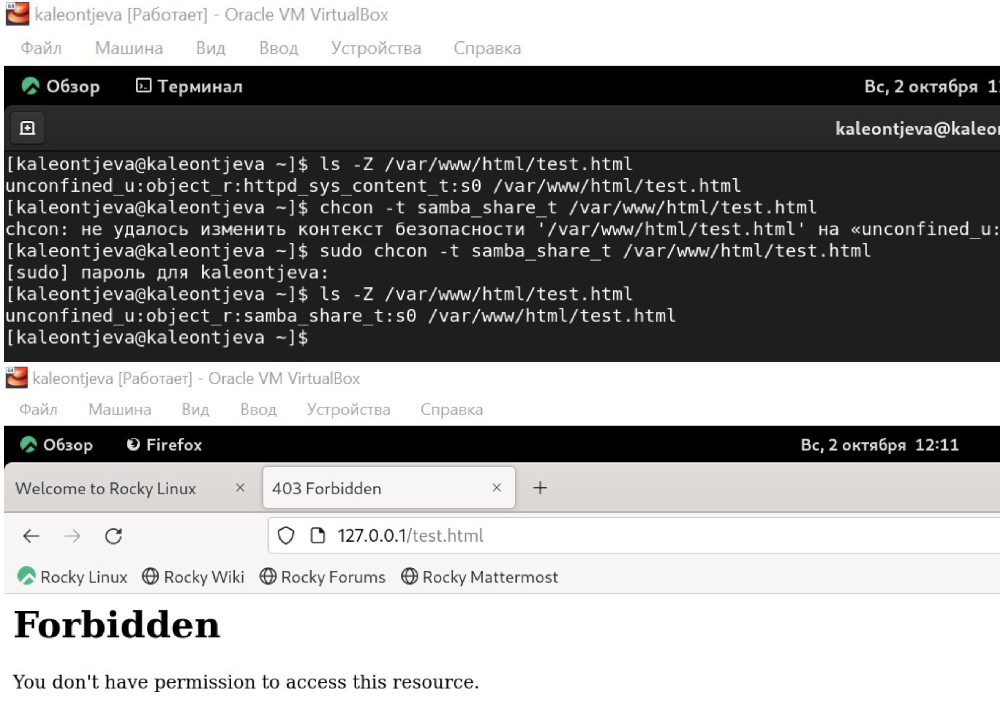

---
## Front matter
lang: ru-RU
title: Лабораторная работа №6
subtitle: Информационная безопасность
author:
  - Леонтьева К. А., НПМбд-01-19
institute:
  - Российский университет дружбы народов
  - Москва, Россия
date: 3 октября 2022

## i18n babel
babel-lang: russian
babel-otherlangs: english

## Formatting pdf
toc: false
toc-title: Содержание
slide_level: 2
aspectratio: 169
section-titles: true
theme: metropolis
header-includes:
 - \metroset{progressbar=frametitle,sectionpage=progressbar,numbering=fraction}
 - '\makeatletter'
 - '\beamer@ignorenonframefalse'
 - '\makeatother'
---

## Цели лабораторной работы

1) Развить навыки администрирования ОС Linux
2) Получить первое практическое знакомство с технологией SELinux
3) Проверить работу SELinux на практике совместно с веб-сервером Apache.

## Задачи лабораторной работы
1) Проверить корректность работы SELinux, запустить веб-сервер Apache
2) Создать файл test.html
3) Обратиться к файлу через веб-сервер при разном контексте и порте

## Ход выполнения лабораторной работы
- Проверила, что SELinux работает в режиме enforcing политики targeted с помощью команд "getenforce" и "sestatus"

{ #fig:001 width=55% }

## Ход выполнения лабораторной работы
- Обратилась с помощью браузера к веб-серверу, запущенному на моем компьютере, и убедилась, что последний работает с помощью команды "service httpd status" 

{ #fig:002 width=55% }

## Ход выполнения лабораторной работы
- От имени суперпользователя создала файл test.html. Обратилась к нему через веб-сервер, введя адрес "http://127.0.0.1/test.html".

{ #fig:003 width=55% }

## Ход выполнения лабораторной работы
- Изменила контекст файла на samba_share_t. Попробовала получить доступ к файлу через веб-сервер и получила сообщение об ошибке

{ #fig:004 width=55% }

## Ход выполнения лабораторной работы
- В файле /etc/httpd/conf/httpd.conf заменила строчку "Listen 80" на "Listen 81", чтобы установить веб-сервер Apache на прослушивание TCP-порта 81

{ #fig:005 width=80% }

## Ход выполнения лабораторной работы
- Выполнила команду "semanage port -a -t http_port_t -р tcp 81" и убедилась, что порт TCP-81 установлен. Проверила список доступных портов

{ #fig:006 width=80% }

## Ход выполнения лабораторной работы
- Вернула контекст "httpd_sys_cоntent_t" файлу test.html и попробовала получить доступ к файлу через веб-сервер, введя адрес "http://127.0.0.1:81/test.html"

{ #fig:007 width=55% }

## Вывод
- В ходе выполнения данной лабораторной работы я развила навыки администрирования ОС Linux, получила первое практическое знакомство с технологией SELinux и проверила работу SELinux на практике совместно с веб-сервером Apache.

