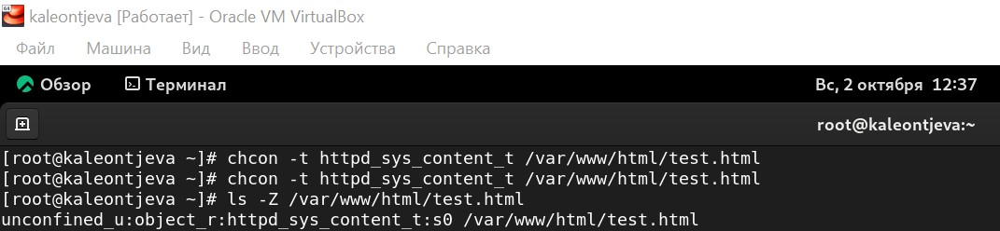

---
## Front matter
title: "Лабораторная работа №6"
subtitle: "Информационная безопасность"
author: "Леонтьева Ксения Андреевна | НПМбд-01-19"

## Generic otions
lang: ru-RU
toc-title: "Содержание"

## Bibliography
bibliography: bib/cite.bib
csl: pandoc/csl/gost-r-7-0-5-2008-numeric.csl

## Pdf output format
toc: true # Table of contents
toc-depth: 2
lof: true # List of figures
fontsize: 12pt
linestretch: 1.5
papersize: a4
documentclass: scrreprt
## I18n polyglossia
polyglossia-lang:
  name: russian
  options:
	- spelling=modern
	- babelshorthands=true
polyglossia-otherlangs:
  name: english
## I18n babel
babel-lang: russian
babel-otherlangs: english
## Fonts
mainfont: PT Serif
romanfont: PT Serif
sansfont: PT Sans
monofont: PT Mono
mainfontoptions: Ligatures=TeX
romanfontoptions: Ligatures=TeX
sansfontoptions: Ligatures=TeX,Scale=MatchLowercase
monofontoptions: Scale=MatchLowercase,Scale=0.9
## Biblatex
biblatex: true
biblio-style: "gost-numeric"
biblatexoptions:
  - parentracker=true
  - backend=biber
  - hyperref=auto
  - language=auto
  - autolang=other*
  - citestyle=gost-numeric
## Pandoc-crossref LaTeX customization
figureTitle: "Рис."
tableTitle: "Таблица"
listingTitle: "Листинг"
lofTitle: "Список иллюстраций"
lotTitle: "Список таблиц"
lolTitle: "Листинги"
## Misc options
indent: true
header-includes:
  - \usepackage{indentfirst}
  - \usepackage{float} # keep figures where there are in the text
  - \floatplacement{figure}{H} # keep figures where there are in the text
---

# Цель работы

Развить навыки администрирования ОС Linux. Получить первое практическое знакомство с технологией SELinux. Проверить работу SELinux на практике совместно с веб-сервером Apache.

# Теоретическое введение

SELinux (Security-Enhanced Linux) обеспечивает усиление защиты путем внесения изменений как на уровне ядра, так и на уровне пространства пользователя, что превращает ее в действительно «непробиваемую» операционную систему. Впервые эта система появилась в четвертой версии CentOS, а в 5 и 6 версии реализация была существенно дополнена и улучшена. 

SELinux имеет три основных режим работы:

* Enforcing: Режим по-умолчанию. При выборе этого режима все действия, которые каким-то образом нарушают текущую политику безопасности, будут блокироваться, а попытка нарушения будет зафиксирована в журнале.

* Permissive: В случае использования этого режима, информация о всех действиях, которые нарушают текущую политику безопасности, будут зафиксированы в журнале, но сами действия не будут заблокированы.

* Disabled: Полное отключение системы принудительного контроля доступа.

Политика SELinux определяет доступ пользователей к ролям, доступ ролей к доменам и доступ доменов к типам. 

Контекст безопасности — все атрибуты SELinux — роли, типы и домены.
 
Более подробно см. в [@SELinux:bash].

Apache — это свободное программное обеспечение, с помощью которого можно создать веб-сервер. Данный продукт возник как доработанная версия другого HTTP-клиента от национального центра суперкомпьютерных приложений (NCSA).

Для чего нужен Apache сервер:

* чтобы открывать динамические PHP-страницы,

* для распределения поступающей на сервер нагрузки,

* для обеспечения отказоустойчивости сервера,

* чтобы потренироваться в настройке сервера и запуске PHP-скриптов.

Apache является кроссплатформенным ПО и поддерживает такие операционные системы, как Linux, BSD, MacOS, Microsoft, BeOS и другие.

Более подробно см. в [@Apache:bash].

# Выполнение лабораторной работы

Вошла в систему под своей учетной записью и убедилась, что SELinux работает в режиме enforcing политики targeted с помощью команд "getenforce" и "sestatus" (рис. [-@fig:001]).
 
{ #fig:001 width=110% }
 
Обратилась с помощью браузера к веб-серверу, запущенному на моем компьютере, и убедилась, что последний работает с помощью команды "service httpd status" (рис. [-@fig:002]).

{ #fig:002 width=110% }

С помощью команды "ps auxZ | grep httpd" определила контекст безопасности веб-сервера Apache - httpd_t (рис. [-@fig:003]).

{ #fig:003 width=110% }

Посмотрела текущее состояние переключателей SELinux для Apache с помощью команды "sestatus -bigrep httpd", многие из переключателей находятся в положении "off" (рис. [-@fig:004]).

{ #fig:004 width=110% }

Посмотрела статистику по политике с помощью команды "seinfo". Множество пользователей - 8, ролей - 14, типов 4995 (рис. [-@fig:005]).

{ #fig:005 width=110% }

С помощью команды "ls -lZ /var/www" посмотрела файлы и поддиректории, находящиеся в директории /var/www. Используя команду "ls -lZ /var/www/html", определила, что в данной директории файлов нет. Только владелец/суперпользователь может создавать файлы в директории /var/www/html (рис. [-@fig:006]).

{ #fig:006 width=110% }

От имени суперпользователя создала html-файл /var/www/html/test.html. Контекст созданного файла - httpd_sys_content_t (рис. [-@fig:007]).

{ #fig:007 width=110% }

Обратилась к файлу через веб-сервер, введя в браузере адрес "http://127.0.0.1/test.html". Файл был успешно отображен (рис. [-@fig:008]).

{ #fig:008 width=110% }

Изучив справку man httpd_selinux, выяснила, что для httpd определены следующие контексты файлов: httpd_sys_content_t, httpd_sys_script_exec_t, httpd_sys_script_ro_t, httpd_sys_script_rw_t, httpd_sys_script_ra_t, httpd_unconfined_script_exec_t. Контекст моего файла - httpd_sys_content_t (в таком случае содержимое должно быть доступно для всех скриптов httpd и для самого демона). Изменила контекст файла на samba_share_t командой "sudo chcon -t samba_share_t /var/www/html/test.html" и проверила, что контекст поменялся (рис. [-@fig:009]).

{ #fig:009 width=110% }

Попробовала еще раз получить доступ к файлу через веб-сервер, введя в браузере адрес "http://127.0.0.1/test.html" и получила сообщение об ошибке (т.к. к установленному ранее контексту процесс httpd не имеет доступа) (рис. [-@fig:010]).

{ #fig:010 width=110% }

Командой "ls -l /var/www/html/test.html" убедилась, что читать данный файл может любой пользователь. Просмотрела системный лог-файл веб-сервера Apache командой "sudo tail /var/log/messages", отображающий ошибки (рис. [-@fig:011]).

{ #fig:011 width=110% }

В файле /etc/httpd/conf/httpd.conf заменила строчку "Listen 80" на "Listen 81", чтобы установить веб-сервер Apache на прослушивание TCP-порта 81 (рис. [-@fig:012]).

{ #fig:012 width=110% }

Перезапускаем веб-сервер Apache и анализирует лог-файлы командой "tail -nl /var/log/messages" (рис. [-@fig:013]).

{ #fig:013 width=110% }

Просмотрела файлы "var/log/http/error_log", "/var/log/http/access_log" и "/var/log/audit/audit.log" и выяснила, что запись появилась в последнем файле (рис. [-@fig:014]).

{ #fig:014 width=110% }

Выполнила команду "semanage port -a -t http_port_t -р tcp 81" и убедилась, что порт TCP-81 установлен. Проверила список портов командой "semanage port -l | grep http_port_t", убедилась, что порт 81 есть в списке и запускаем веб-сервер Apache снова (рис. [-@fig:015]).

{ #fig:015 width=110% }

Вернула контекст "httpd_sys_cоntent_t" файлу "/var/www/html/test.html" командой "chcon -t httpd_sys_content_t /var/www/html/test.html" (рис. [-@fig:017]) и после этого попробовала получить доступ к файлу через веб-сервер, введя адрес "http://127.0.0.1:81/test.html", в результате чего увидела содежимое файла - слово "test" (рис. [-@fig:016]).

{ #fig:017 width=110% }

{ #fig:016 width=110% }

Исправила обратно конфигурационный файл apache, вернув "Listen 80". Попыталась удалить привязку http_port к 81 порту командой "semanage port -d -t http_port_t -p tcp 81", но этот порт определен на уровне политики, поэтому его нельзя удалить (рис. [-@fig:018]).

{ #fig:018 width=110% }

Удалила файл "/var/www/html/test.html" командой "rm /var/www/html/test.html" (рис. [-@fig:019]).

{ #fig:019 width=110% }

# Выводы

В ходе выполнения данной лабораторной работы я развила навыки администрирования ОС Linux, получила первое практическое знакомство с технологией SELinux и проверила работу SELinux на практике совместно с веб-сервером Apache.

# Список литературы{.unnumbered}

::: {#refs}
:::

