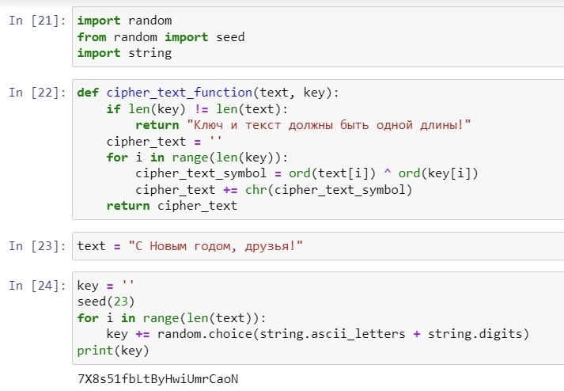
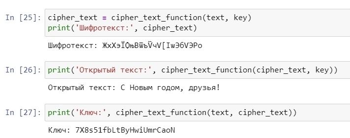

---
## Front matter
lang: ru-RU
title: Лабораторная работа №7
subtitle: Информационная безопасность
author:
  - Леонтьева К. А., НПМбд-01-19
institute:
  - Российский университет дружбы народов
  - Москва, Россия
date: 18 октября 2022

## i18n babel
babel-lang: russian
babel-otherlangs: english

## Formatting pdf
toc: false
toc-title: Содержание
slide_level: 2
aspectratio: 169
section-titles: true
theme: metropolis
header-includes:
 - \metroset{progressbar=frametitle,sectionpage=progressbar,numbering=fraction}
 - '\makeatletter'
 - '\beamer@ignorenonframefalse'
 - '\makeatother'
---

## Цели лабораторной работы

1) Освоить на практике применение режима однократного гаммирования.

## Задачи лабораторной работы
1) Написать программу на языке Python, реализующую режим однократного гаммирования.

## Ход выполнения лабораторной работы
- In[21]: импорт необходимых библиотек
- In[22]: функция, реализующая сложение по модулю два двух строк
- In[23]: открытый/исходный текст
- In[24]: создание ключа той же длины, что и открытый текст

{ #fig:001 width=45% }

## Ход выполнения лабораторной работы
- In[25]: получение шифротекста, при условии, что известны открытый текст и ключ
- In[26]: получение открытого текста, при условии, что известны шифротекст и ключ
- In[27]: получение ключа, при условии, что известны открытый текст и шифротекст

{ #fig:002 width=55% }

## Вывод
- В ходе выполнения данной лабораторной работы я освоила на практике применение режима однократного гаммирования.

