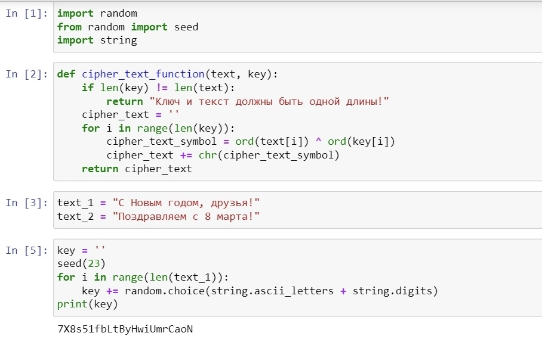
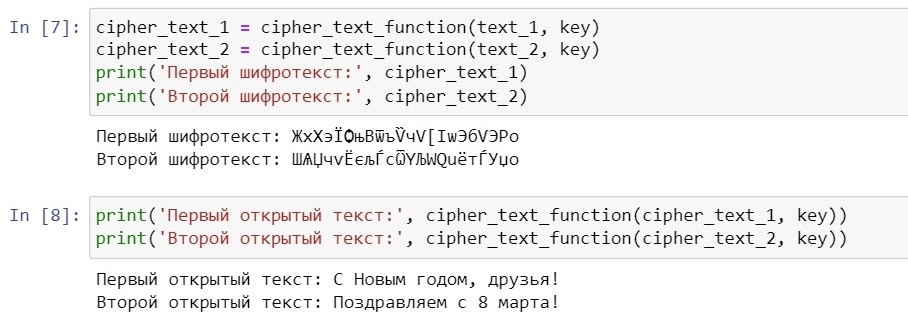
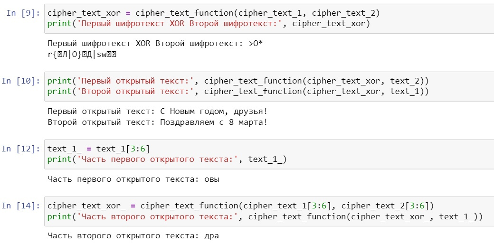

---
## Front matter
lang: ru-RU
title: Лабораторная работа №8
subtitle: Информационная безопасность
author:
  - Леонтьева К. А., НПМбд-01-19
institute:
  - Российский университет дружбы народов
  - Москва, Россия
date: 18 октября 2022

## i18n babel
babel-lang: russian
babel-otherlangs: english

## Formatting pdf
toc: false
toc-title: Содержание
slide_level: 2
aspectratio: 169
section-titles: true
theme: metropolis
header-includes:
 - \metroset{progressbar=frametitle,sectionpage=progressbar,numbering=fraction}
 - '\makeatletter'
 - '\beamer@ignorenonframefalse'
 - '\makeatother'
---

## Цели лабораторной работы

1) Освоить на практике применение режима однократного гаммирования на примере кодирования различных исходных текстов одним ключом.

## Задачи лабораторной работы
1) Написать программу на языке Python, реализующую режим однократного гаммирования для двух текстов, кодируемых одним ключом.

## Ход выполнения лабораторной работы
- In[1]: импорт необходимых библиотек
- In[2]: функция, реализующая сложение по модулю два двух строк
- In[3]: открытые/исходные тексты (одинаковой длины)
- In[5]: создание ключа той же длины, что и открытые тексты

{ #fig:001 width=45% }

## Ход выполнения лабораторной работы
- In[7]: получение шифротекстов при условии, что известны открытые тексты и ключ
- In[8]: получение открытых текстов при условии, что известны шифротексты и ключ

{ #fig:002 width=55% }

## Ход выполнения лабораторной работы
- In[9]: сложение по модулю два двух шифротекстов
- In[10]: получение открытых текстов при условии, что известны оба шифротекста и один из открытых текстов
- In[12]: получение части первого открытого текста (срез)
- In[14]: получение части второго текста при условии, что известны оба шифротекста и часть первого открытого текста

{ #fig:003 width=55% }

## Вывод
- В ходе выполнения данной лабораторной работы я освоила на практике применение режима однократного гаммирования на примере кодирования различных исходных текстов одним ключом.

